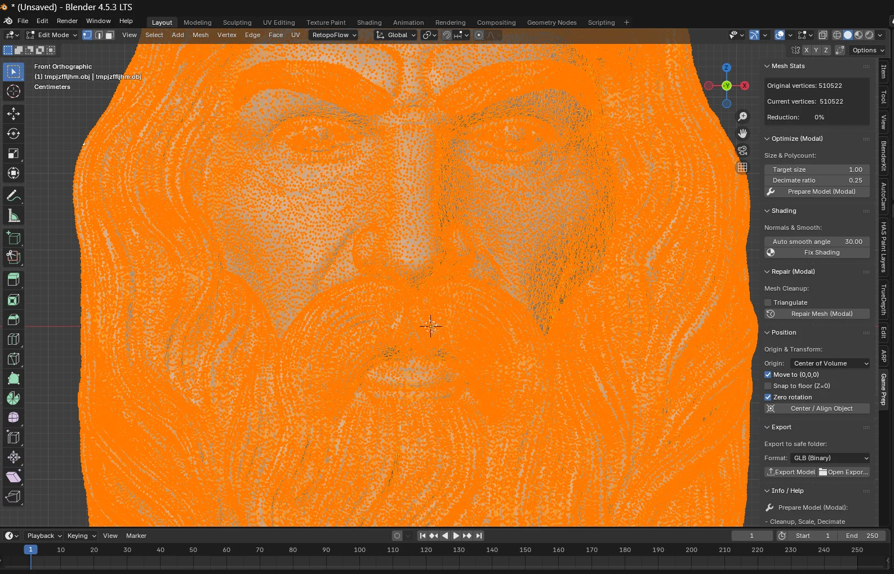
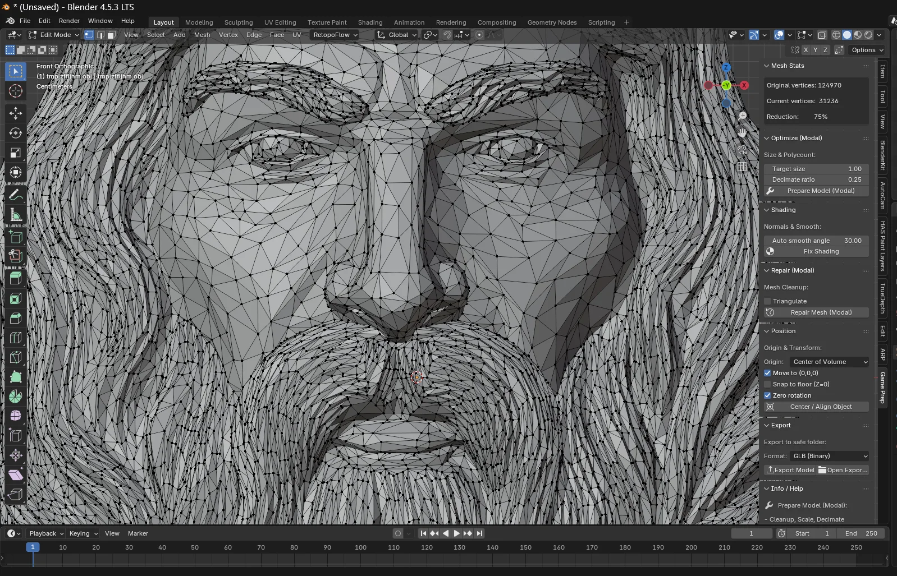
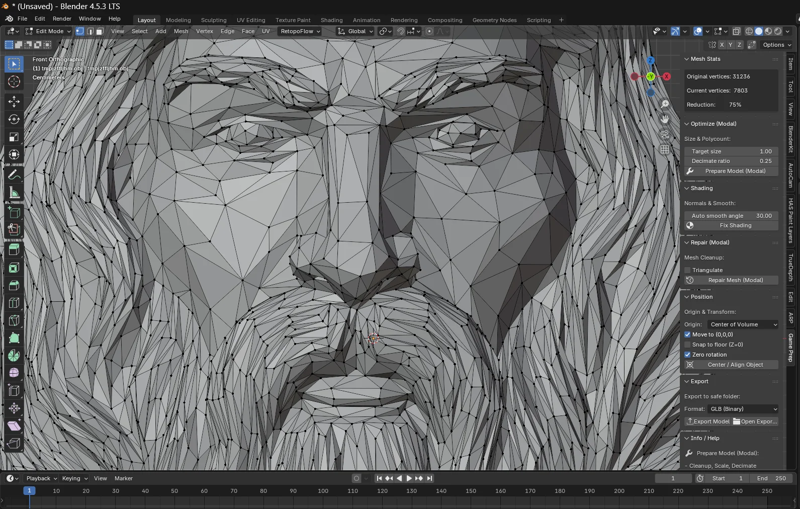
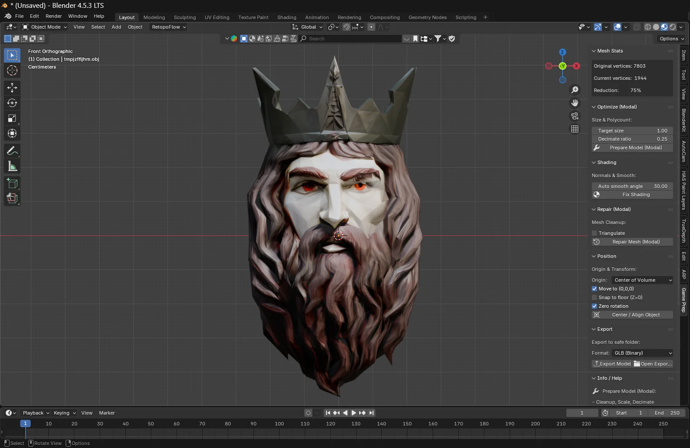

# 

# **BarBarossa Game Model Prep**  
**Blender Add-on for optimizing, repairing and preparing high-density 3D models for game engines**

**Version:** v1.0.0  
**Author:** BarBarossa Media  
**License:** MIT

---

## 🎯 **Overview**

**BarBarossa Game Model Prep** is a Blender add-on designed to drastically simplify the process of preparing complex, high-poly 3D models for real-time use in **games, WebGL, AR/VR, and mobile applications**.

It was created specifically to clean up AI-generated or sculpted meshes and convert them into **lightweight, engine-friendly models** — fast, automated and artist-friendly.

---

## 🚀 **Key Features**

### 🔧 **Mesh Optimization (Modal Pipeline)**
- Automatic **decimation / polycount reduction**
- Targeted optimization based on **desired file size or target density**
- Repeated optimization maintains silhouette quality

### 🧹 **Mesh Repair Tools**
- Remove doubles
- Delete loose geometry
- Fill holes
- Make manifold
- Triangulate (optional)
- Automatic shading cleanup

### 🧭 **Position, Orientation & Alignment**
- Set origin to **Center of Volume** or **Geometry**
- Move model to **(0,0,0) world center**
- Snap to **floor level**
- Zero rotation function  
- One-click “Align Object”

### 🎥 **Preview Tools**
- Auto-Rotate for quick visual checking
- Adjustable rotation speed

### 📤 **Export Tools**
- Export to a safe folder
- GLB (Binary) & other formats supported
- One-click “Export Model”

---

## 🖼️ **Before → After (Mesh Reduction Preview)**

### 🔸 Original Mesh  
(over 500.000 vertices)

### 🔸 After multiple optimization passes  
(~7.800 vertices)

---

## 📦 **Installation**

### **1. Download**
➡ **Download the Install-ZIP here:**  
**[barbarossa_game_model_prep_install_v1_0_0.zip](https://github.com/Bar-Barossa/barbarossa-game-model-prep/releases/latest)**

### **2. Install in Blender**
1. Open **Blender**
2. Go to:  
   **Edit → Preferences → Add-ons → Install**
3. Select the ZIP file  
   `barbarossa_game_model_prep_install_v1_0_0.zip`
4. Activate the checkbox  
   **BarBarossa Game Model Prep**

Done! 🎉

---

## 📘 **Usage**

After installation:  
You will find the add-on in the **N-Panel** under:

➡ **Game Prep**

From here you can:
- Run the full optimization pipeline  
- Clean, align, fix, and prepare models  
- Auto-rotate to examine mesh integrity  
- Export optimized GLB files  

---

## ❤️ **Support My Work**

If you enjoy this tool and want to support future development, you can donate here:

👉 **[Donate via PayPal](https://www.paypal.com/donate/?hosted_button_id=RKGR6LSU7WD8U)**

Your support helps me create more tools for the Blender & 3D community.

---

## 📄 License (MIT)

This project is licensed under the MIT License — free to use, modify, and distribute.

---

## 👑 **Credits**

Created with passion by  
**BarBarossa Media**  
www.barbarossa-media.de

---
