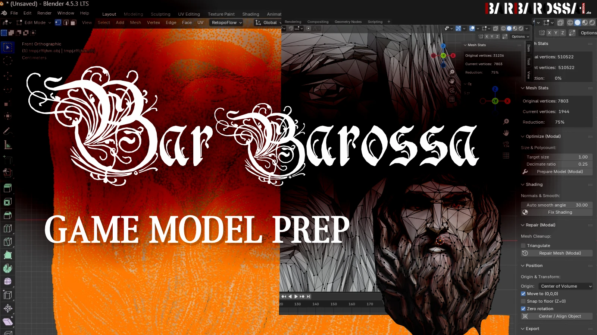
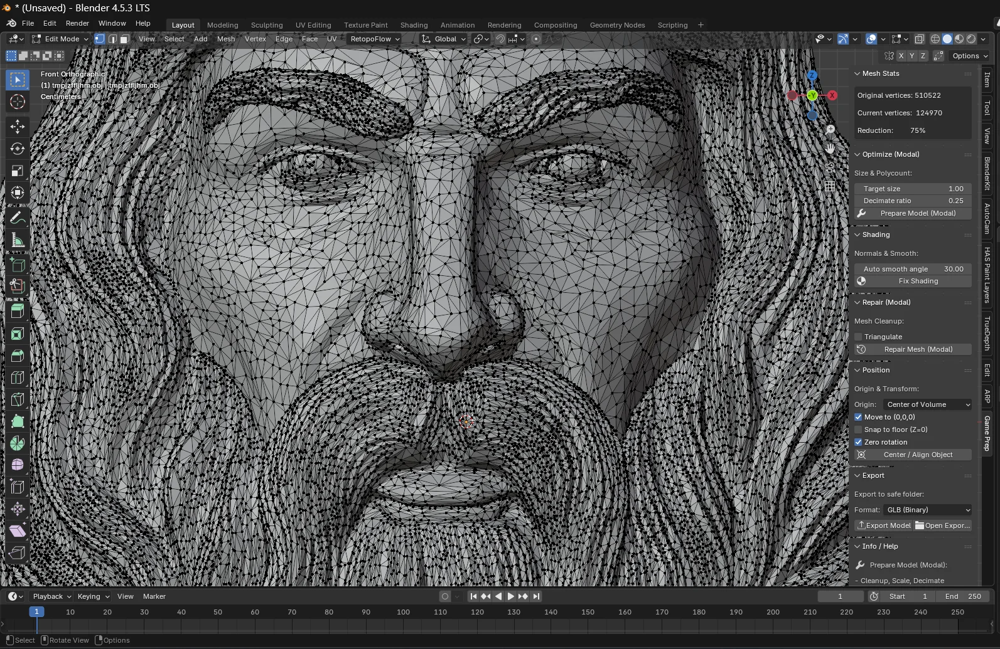

<!-- Banner -->

  

<h1 align="center">BarBarossa Game Model Prep</h1>

  A powerful Blender tool for fast, clean and reliable game-model preparation. 
  Compatible with <strong>Blender 4.2+</strong> · Ideal for <strong>Unity, Unreal, Godot</strong>.

---

## 🚀 Features

- ⚙️ **Automatic mesh cleanup**
- ✂️ **Smart decimation** (percentage + target size)
- 🔄 **Fix broken normals** & shading artifacts
- 🔧 **Mesh repair tools** (triangulate, cleanup, merge)
- 🎯 **Auto-center, snap-to-floor & zero-rotation**
- 📐 **UV validation & automatic UV generation**
- 📦 **Batch processing support**
- 🏎 **Optimized for large or complex scenes**
- 🎮 Ready for export to game engines (GLB, FBX, OBJ)

---

## 🖼 Before / After Preview

<table>
<tr>
<td align="center">Original mesh: 510.000 vertices* </td>
<td align="center">Final mesh after optimization: 1.900 vertices</td>
</tr>
<tr>
<td></td>
<td></td>
</tr>
</table>

---

## 📥 Installation

### **1. Download**
Lade die aktuelle Version hier herunter:

👉 **`add-on-barbarossa-game-prep-v3.1.5.zip`**

---

### **2. Install in Blender**

1. Blender öffnen  
2. **Edit → Preferences → Add-ons**  
3. **Install…** anklicken  
4. ZIP-Datei auswählen (nicht entpacken)  
5. Aktivieren ✔

---

## 🛠 Usage Overview

### 🔧 1. Optimize (Modal)
- Automatic decimation  
- Polycount control  
- UV generation  
- Cleanup options  

### 🧽 2. Repair Tools
- Triangulate  
- Remove doubles  
- Normal fixes  

### 🎯 3. Position & Export
- Auto-center object  
- Snap to floor  
- Zero rotation  
- Export as GLB/FBX/OBJ  

---

## 📸 More Preview Images

  
  

  

---

## ❤️ Support My Work

If you enjoy this tool and want to support future updates:

  

---

## 📣 Version History

### **v3.1.5 – Initial Release for Blender Extensions**  
- Added automatic mesh cleanup  
- Added transform & scale correction  
- Added UV validation & automatic UV generation  
- Implemented normal recalculation  
- Added batch processing support  
- Improved naming consistency  
- Improved performance for large scenes  
- Compatible with Blender 4.2+

---

## 📝 License  
MIT License — see `LICENSE` file.

---

## 📫 Contact  
For questions, ideas or feedback:  
👉 https://github.com/Bar-Barossa/barbarossa-game-model-prep/issues

---

  Made with ❤️ by <strong>BarBarossa</strong>

